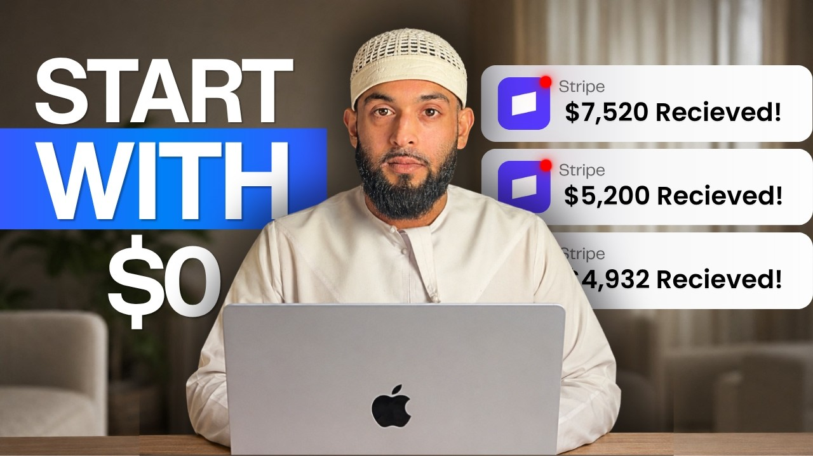
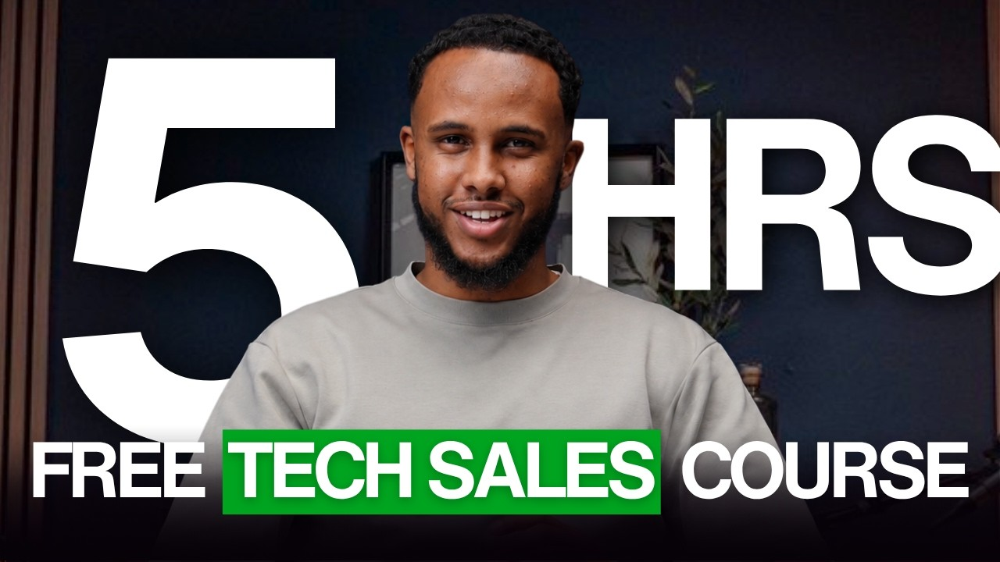
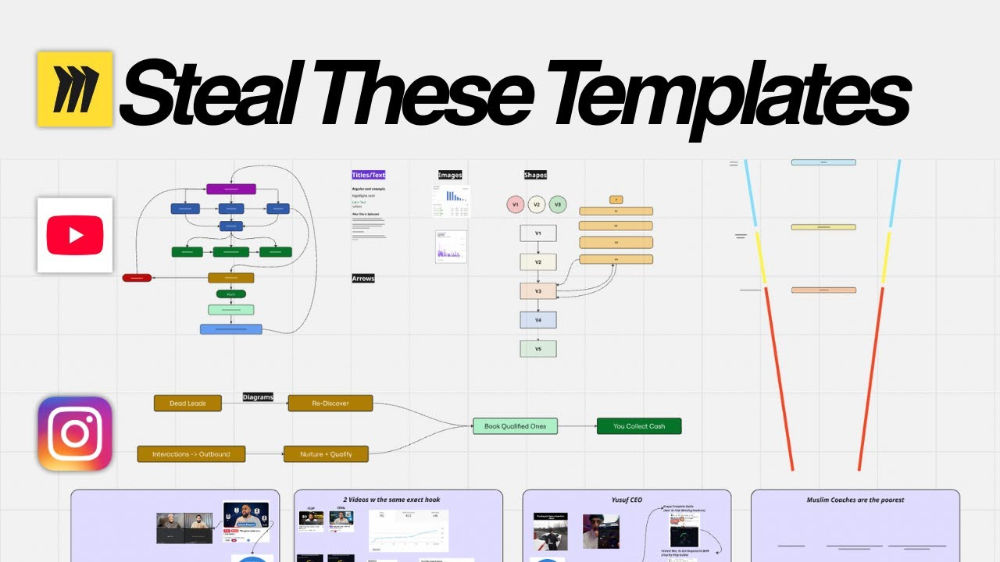

> Source tab `t.a780sqdh2kjj` · 4 image(s) · 672 words

# How Does The YouTube Garden Work

## 1. The Fertilizer

Most YouTube agencies create content and hope it gets discovered.

We start by finding demand that already exists.

Before creating a single video, we identify what your ideal clients are actively searching for on YouTube and build content around those searches.

In fact, here's a challenge:

Go to YouTube right now and search:

1. Appointment Setting
2. Tech Sales Course
3. How To Make Miro Boards For Instagram
4. Arabic Grammar For Beginners

There's a good chance you'll find videos from our clientsranking in the top 3for those exact searches.

Why does this matter?

Because these aren't random viewers scrolling social media.

These are people actively looking for solutions.

When someone searches for a problem they're trying to solve and finds your content, you've skipped the hardest part of marketing:

Getting their attention.

Instead of chasing prospects, we position your content where buyers are already looking.

And from these videos they enter the next step of our funnel

## 2. The Seeds

Getting found is only half the battle.

Just because someone finds your video doesn't mean they'll become a client.

That's where the Seeds come in.

Once someone discovers your channel through one of our ranking videos, we strategically guide them deeper into your content ecosystem.

These videos are designed to create interest, build trust, and increase watch time across your channel.

Examples include:

- Case Studies
- How-To Videos
- Software Tutorials
- Beleif Shifting Videos
- Framework Breakdowns
- Industry News/Commentary
- Lead Magnet Videos

Think of these as the bridge between discovery and conversion.

Every seed is designed to lead viewers closer to the content that actually generates clients.

The goal is moving the right people deeper into your world.

The longer a prospect stays in your ecosystem, the more they trust you.

And trust is what ultimately drives conversions.

## 3. The Roots

The Fertilizer gets us discovered.

The Seeds get prospects interested.

The Roots converts them to clients.

Before someone buys from you, they only need to be sold on two things:

### 1. The Vehicle

The actual Business model

Video Examples:

- How Appointment Setting Works
- Why Organic Content Beats Paid Ads
- How To Land Your First Tech Sales Job
- The Exact System We Use To Generate Leads

### 2. The Driver

The person behind the method can actually help me.

Examples:

- How I Built A 6 Figure Tutoring Business From My Bedroom
- How This Arabic Coach Scaled His Business From 0-$16k/mo
- Watch Me Book 5 Meetings in 30 Minutes

### Why This Matters

Most prospects don't buy because they either don't believe.

- That the method works.
- That the person teaching it can help them.

The Roots solve both problems and every video we create solves these two objections.

Once a prospect believes in both the Vehicle and the Driver, they just show up to the call to figure out logistics sale becomes significantly easier.

# Why YouTube Changes Everything

1. Your ads convert better

When someone sees your ad and searches your name, they find a channel full of content that builds trust instantly. The ad gets the click. YouTube closes the deal.

2. Your referrals close faster

When someone gets referred to you and watches 30 minutes of your content before the call, they show up already sold. Your existing network becomes exponentially more powerful.

3. Your prices go up

When you are the most visible, most trusted authority in your space, raising your prices stops being a conversation. It becomes obvious.

4. Your recruiting gets easier

New team members, contractors, and partners can watch your content and understand exactly who you are before they ever speak to you.

5. YouTube never expires

A post on Instagram is dead in 48 hours. A video on YouTube is still generating leads two years after you filmed it. The work compounds. It never stops working. That is the difference between renting attention and owning it.
